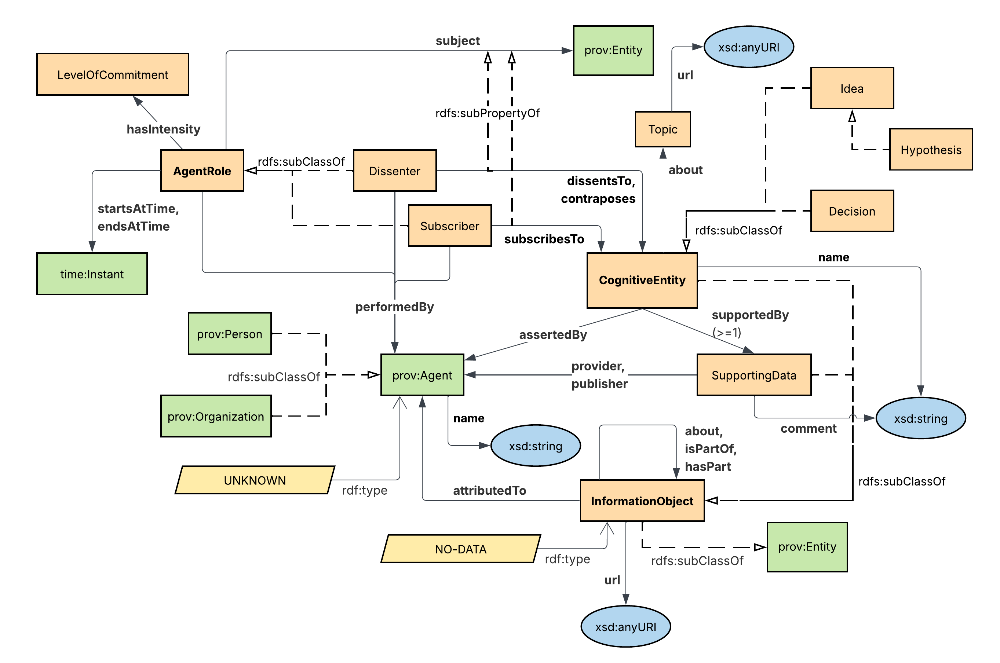

# KGBuilder-MC1
Speed Presentation

## Table of Contents

1. [Problem & Use Cases](#1-problem--use-cases)
2. [Proposed Schema Elements](#2-proposed-schema-elements)
   - [Conceptual Model](#conceptual-model)
   - [Ontology](#ontology) ([ttl](ontology.ttl))
3. [Identifier Strategy](#3-identifier-strategy)
   - [Unique Identifiers](#unique-identifiers)
   - [Namespaces](#namespaces)

## 1-Problem & Use Cases

### Problem 
Existing bookmarking tools like Pinterest and browser favorites save web links but fail to organize them around the ideas they support—whether insights, decisions, or hypotheses. Over time, I remember my conclusions but cannot easily trace which sources informed multiple ideas, identify authors, or recall dissenting perspectives, making it difficult to reconstruct my evidence-based thinking or recognize cross-referenced content.

I want to create a knowledge graph that helps me accomplish two main objectives:

1) organize & annotate information in a way that builds up to how I view it supporting an idea, hypothesis or decision;
2) be able to start by formulating an idea, hypothesis or decision and build the supporting data as I progress.

#### Scenario/Industry

I've built a couple of application ontologies in the past, and I wanted to take a stab at something higher-level. I am looking to develop some pattern that can be applied across multiple industries. For this exercise, the scenarios I've chosen are 

1. Decision-making - in software development, there is a strategy called Architectural Decision Records (ADRs) that are typically used in Git repositories that summarize decisions made by a team  that are hard to decipher by reading an issue - especially lengthy issues. As a new person to the repository, it's hard to understand who the voices of authority and influence are, what pieces of content can be ignored, etc. An ADR is a summary of all this content (example: https://github.com/ESIPFed/science-on-schema.org/tree/main/decisions)

### Use Cases

1. Who are the top 5 people that contributed to my belief in that the "4% rule" is an effective retirement withdrawal strategy?
2. What are all the decisions asserted by myself having any dissenters that supported the decision to invest in "data-centric architecture" that are stored in Github?

## 2-Proposed Schema Elements

### Conceptual Model

----

#### Graphical Notation

### Ontology

[Ontology (ttl)](ontology.ttl) - here is a Turtle file built using Protege. 

## 3-Identifier Strategy

I envision the use of this ontology for applications that are quick and easy (similar to Pinterest). Required fields are minimal. You want to be able to save some URL to a podcast, write a quick note, and go. Further annotation can happen afterward. This direction helps inform identifier strategy.

### Unique Identifiers 

**Ontology** - I chose URLs to identify classes, properties and named individuals. I want to publish this ontology at a website so that it can be shared and re-used. Becuase of this, I chose **slash termination** so that I have the freedom to use the hash terminator in URLs to be able to direct users to certain aspects of a webpage for the element being addressed at its ontology URI. This gives me downstream flexibility in case the website has individual webpages for its ontological element. For example, the `https://schema.harborlight.tech/ontology/dikw/v0.1/Dissenter` webpage may have certain elements with named anchor tags for: description, conceptual drawing, examples of usage, etc. the hash will let me direct a browser to these individual elements in web space while the slash terminator is used in ontology space.

**Entities/Data** - Because I'm thinking data will be entered through some application, and the data seems to not be something publicly available in all cases, I think I'd lean towards using a URN structure like: `urn:harborlighttech:dikw:{uuid}`. With the `:url` property, web-accessible data can be accessed through this and then URL management (ex: link rot) is up to the user. 

### Namespaces 

I found a lot of similarity with PROV-O and could model most of what I had here with PROV, so I decided to use it as an upper-ontology for this work and extend my classes off of it. I need to investigate more the if some of my properties can be `rdfs:subPropertyOf` some of the relationships in PROV-O, but I feel like that decision can be made downstream, if appropriate to avoid causing any entanglements at the start.

One of my classes, `AgentRole`, had a time component, and I noticed that `prov:Activity` had properties `startedAtTime` & `endedAtTime`, but I was hesitant to commit `AgentRole` to a `prov:Activity`. This is becuase PROV-O seems to describe _the past_, and I didn't want to make that assumption about my `AgentRole` just yet. For example, I might not know when an `AgentRole` had ended. A user might not ever supply that information. So, I left `AgentRole` as a standalone and then re-used the Time Ontology's `time:Instant` class for my start and end date. 
